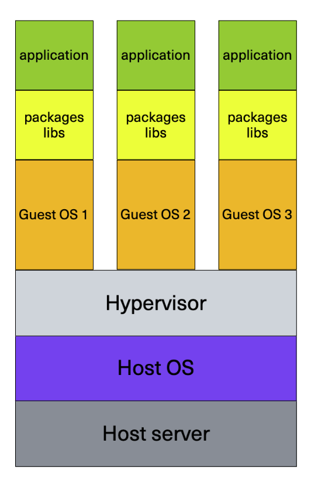
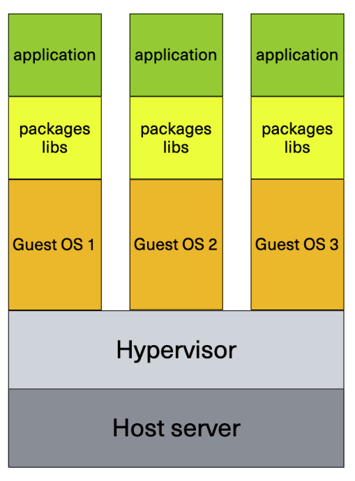
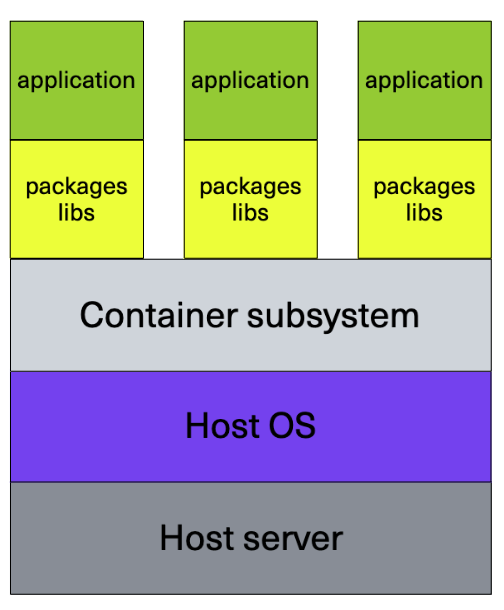

- [Виртуальные машины и контейнеры](#виртуальные-машины-и-контейнеры)
  - [Виртуальные машины](#виртуальные-машины)
  - [Контейнеры](#контейнеры)

# Виртуальные машины и контейнеры

У виртуальных машин и контейнеров общее назначение: они предоставляют среду, имитирующую отдельный компьютер, на котором установлена ОС, и где можно устанавливать и запускать приложения.

С точки зрения запускаемого приложения, нет разницы, запускается оно на ОС реального компьютера, виртуальной машины или контейнера. Тем не менее, ВМ и контейнеры устроены по-разному.

## Виртуальные машины

Для запуска ВМ нужен гипервизор. Гипервизор запускается на реальном компьютере (хост ВМ). Он предоставляет экземплярам ВМ доступ к ресурсам хоста (CPU, RAM, диск, etc.), а также может управлять их жизненным циклом (запускать, останавливать, сохранять состояние).

Гипервизоры можно разделить на 2 основных типа: программные (hosted) и аппаратные (bare metal).

Программный гипервизор:

Аппаратный гипервизор:

Основное отличие между программным и аппаратным гипервизорами в том, что программный  использует механизмы ОС (такие как драйверы или системные вызовы) для доступа к физическим ресурсам и устройствам. То есть, программный гипервизор абстрагируется от реального оборудования, на котором он запускается.

Важной особенностью виртуальных машин (которая отличает их от контейнеров) является то, что для каждого экземпляра выделяется собственная ОС (гостевая ОС). Гостевая ОС может полностью отличаться от ОС хоста.

## Контейнеры

У контейнеров нет собственной гостевой ОС, все экземпляры контейнеров используют ядро ОС хоста:

За счёт этого, контейнер потребляет меньше ресурсов (не нужно запускать отдельную ОС), а также быстрее стартует (не нужно стартовать ОС).
