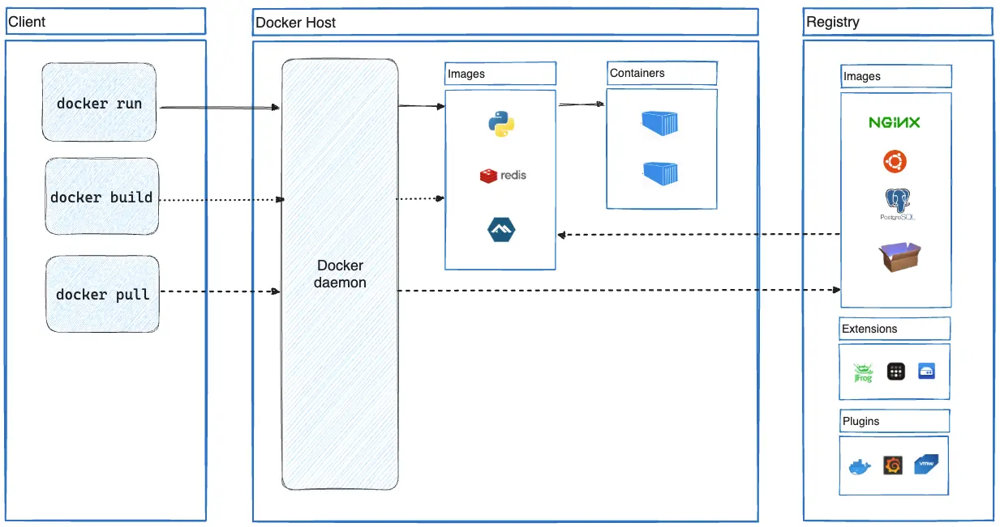

- [Docker](#docker)
  - [Архитектура](#архитектура)
  - [Образы](#образы)
    - [Dockerfile](#dockerfile)
    - [Слои](#слои)
  - [Дополнительные материалы](#дополнительные-материалы)


# Docker

Docker — система контейнеризации, которая работает на базе контейнеров linux. Полезно ознакомиться с [обзором продукта](https://docs.docker.com/get-started/docker-overview/) из официальной документации.

## Архитектура

Схема взята из оф. документации:



Можно выделить следующие важные части:

- **Хост** (docker host) — сервер, на котором разворачиваются контейнеры. На хосте запускается **демон** (docker daemon); он обрабатывает API запросы, управляет жизненным циклом контейнеров, а также другими объектами.
- **Клиент** — посылает запросы в API демона. Клиент может располагаться как на том же хосте, что и докер, так и на отдельном хосте. Один из наиболее распространённых клиентов — docker cli.
- **Образ** контейнера (image) — шаблон, с помощью которых демон создаёт и разворачивает на хосте контейнеры. В образе содержится дистрибутив ОС контейнера, приложение и его локальные зависимости, например, пакеты и файлы конфигураций. 
- **Реестр** образов (registry) — хранилище (как правило, удалённое), в котором хранятся образы. Образ можно загрузить в реестр (`docker push`). Используемые образы скачиваются из реестра и хранятся на хосте. 

## Образы

### Dockerfile

Для того, чтобы собрать образ, используется Dockerfile. Этот файл состоит из инструкций, которые выполняют сверху вниз. Инструкции могут изменять данные и метаданные образа, например:

- выполнять команды (создать папки, установить пакеты)
- добавлять файлы в образ
- устанавливать переменные окружения образа

Пример: [hello.Dockerfile](../code/part2/it1/hello.Dockerfile).

Можно запустить сборку образа из этого файла:

```shell
$ docker build -f hello.Dockerfile .
[+] Building 2.6s (9/9) FINISHED
....
```

После этого, можно найти собранный образ на хосте:

```shell
$ docker image ls
REPOSITORY   TAG         IMAGE ID       CREATED         SIZE
<none>       <none>      d3533be66fee   3 seconds ago   275MB
....
```

Обращаться к образу по его id будет не очень удобно, так что лучше использовать теги:

```shell
$ docker rmi d3533be66fee -f
Deleted: sha256:d3533be66fee5a21f90291b11e4b9dd7adf55c1021af899b07fd1fa6ee6247c9

$ docker build -f hello.Dockerfile -t sem04/hello .
[+] Building 2.5s (9/9) FINISHED
....

$ docker image ls
REPOSITORY    TAG       IMAGE ID       CREATED         SIZE
sem04/hello   latest    964d7a69362f   3 seconds ago   275MB

$ docker container run sem04/hello
Hello World
```

### Слои

Образ состоит из слоёв. Каждый слой — это изменения над файловой системой (создание, удаление, изменение файлов). 

Слои создаются инструкциями `FROM`, `RUN`, `COPY` и `ADD`. При скачивании образа, демон скачивает только те слои, которых ещё нет на хосте. 

Все слои образа являются неизменяемыми. Для каждого контейнера из данного образа создаётся дополнительный read-write слой (т.е. тот, который можно изменять). Таким образом, изменения внутри одного контейнера не влияют ни на образ, ни на другие контейнеры из этого образа.

Вернёмся к образу с меткой `sem04/hello`. Его размер, как было видно из вывода `docker image ls`, составляет 275МБ. Посмотрим, из каких слоёв состоит этот образ:

```
$ docker image history sem04/hello
IMAGE          CREATED          CREATED BY                                      SIZE      COMMENT
964d7a69362f   23 minutes ago   CMD ["hello.out"]                               0B        buildkit.dockerfile.v0
<missing>      23 minutes ago   ENV PATH=/usr/local/app:/go/bin:/usr/local/g…   0B        buildkit.dockerfile.v0
<missing>      23 minutes ago   RUN /bin/sh -c go build -o hello.out ./ # bu…   31.6MB    buildkit.dockerfile.v0
<missing>      23 minutes ago   ENV GO111MODULE=off                             0B        buildkit.dockerfile.v0
<missing>      23 minutes ago   COPY main.go ./ # buildkit                      72B       buildkit.dockerfile.v0
<missing>      2 hours ago      WORKDIR /usr/local/app                          0B        buildkit.dockerfile.v0
<missing>      2 weeks ago      WORKDIR /go                                     0B        buildkit.dockerfile.v0
<missing>      2 weeks ago      RUN /bin/sh -c mkdir -p "$GOPATH/src" "$GOPA…   0B        buildkit.dockerfile.v0
<missing>      2 weeks ago      COPY /target/ / # buildkit                      235MB     buildkit.dockerfile.v0
<missing>      2 weeks ago      ENV PATH=/go/bin:/usr/local/go/bin:/usr/loca…   0B        buildkit.dockerfile.v0
<missing>      2 weeks ago      ENV GOPATH=/go                                  0B        buildkit.dockerfile.v0
<missing>      2 weeks ago      ENV GOTOOLCHAIN=local                           0B        buildkit.dockerfile.v0
<missing>      2 weeks ago      ENV GOLANG_VERSION=1.23.6                       0B        buildkit.dockerfile.v0
<missing>      2 weeks ago      RUN /bin/sh -c apk add --no-cache ca-certifi…   640kB     buildkit.dockerfile.v0
<missing>      2 weeks ago      CMD ["/bin/sh"]                                 0B        buildkit.dockerfile.v0
<missing>      2 weeks ago      ADD alpine-minirootfs-3.21.3-aarch64.tar.gz …   8.17MB    buildkit.dockerfile.v0
```

Из этого вывода можно понять, кто большую часть этого места (235МБ) занимает базовый образ (`FROM golang:1.23-alpine`). Этот образ содержит инструменты, которые используются для сборки приложения на golang, но они не нужны после того, как приложение собрано.

Можно переписать Dockerfile, используя многоступенчатую сборку. Приложение будет собрано на базе одного образа, а запускаться будет на базе другого.

[Многоступенчатая сборка](../code/part2/it2/hello.Dockerfile)

Посмотрим, сколько занимает новый образ:

```shell
 $ docker build -f hello.Dockerfile -t sem04/hello .
[+] Building 0.6s (12/12) FINISHED 
....

$ docker image ls           
REPOSITORY    TAG       IMAGE ID       CREATED              SIZE
sem04/hello   latest    bf255cb3831e   About a minute ago   10.3MB

$ docker container run sem04/hello
Hello World
```

Образ состоит из других слоёв:

```
$ docker image history sem04/hello
IMAGE          CREATED         CREATED BY                                      SIZE      COMMENT
bf255cb3831e   2 minutes ago   CMD ["hello.out"]                               0B        buildkit.dockerfile.v0
<missing>      2 minutes ago   COPY /build/hello.out /bin/hello.out # build…   2.16MB    buildkit.dockerfile.v0
<missing>      10 days ago     CMD ["/bin/sh"]                                 0B        buildkit.dockerfile.v0
<missing>      10 days ago     ADD alpine-minirootfs-3.21.3-aarch64.tar.gz …   8.17MB    buildkit.dockerfile.v0
```

## Дополнительные материалы

Много объяснений с примерами есть в [официальной документации](https://docs.docker.com/get-started/docker-concepts/building-images/understanding-image-layers/) (англ.)

Есть цикл из 6 статей на хабре, [первая статья](https://habr.com/ru/companies/ruvds/articles/438796/) (рус.)
