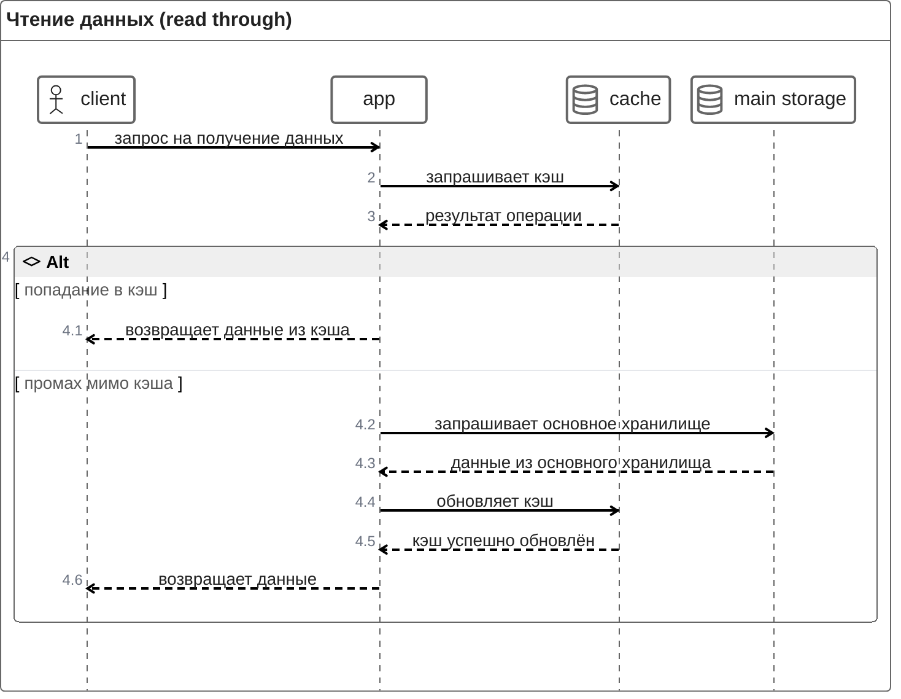
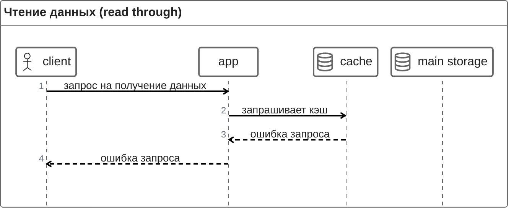
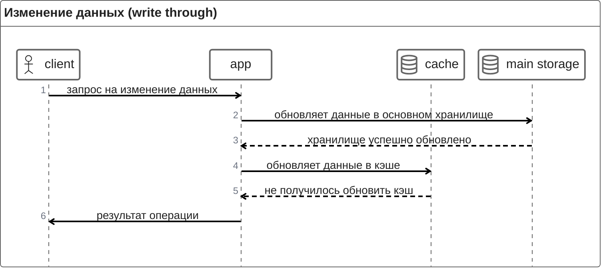
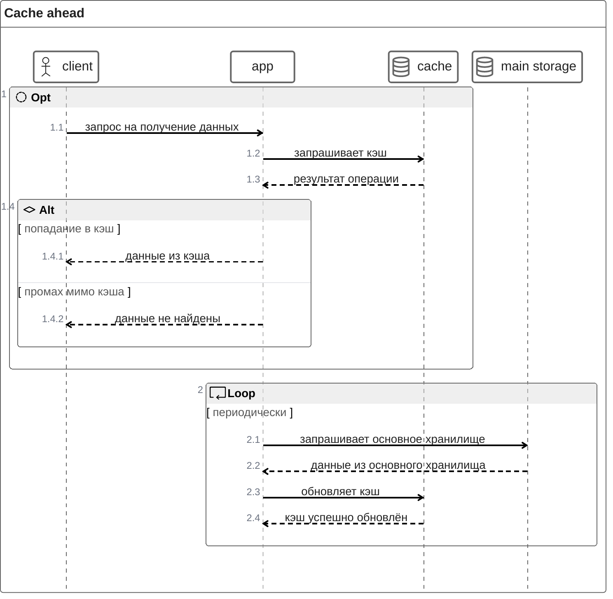
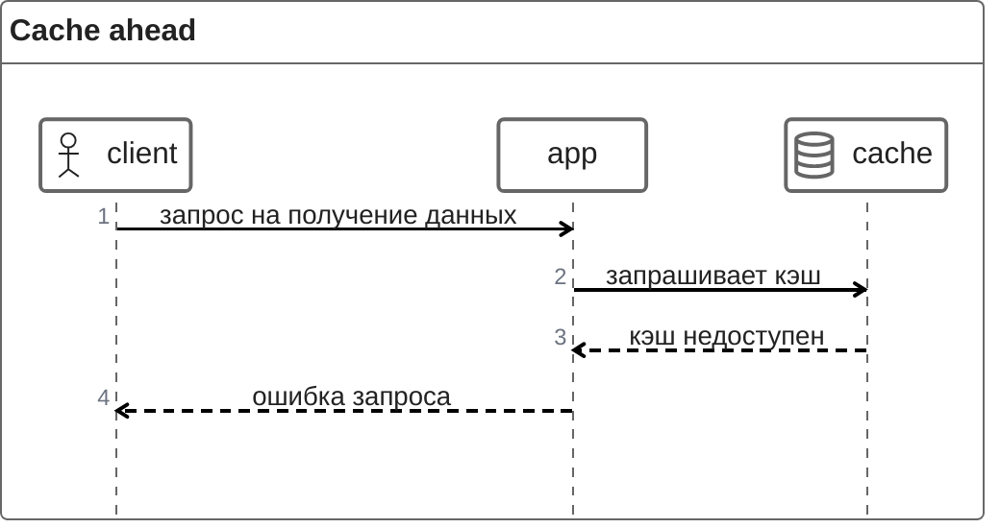

- [Доступ к данным](#доступ-к-данным)
  - [Стратегии доступа](#стратегии-доступа)
    - [Cache through](#cache-through)
    - [Cache ahead](#cache-ahead)
  - [Задержка](#задержка)
  - [CAP теорема](#cap-теорема)
    - [in-app](#in-app)
    - [external](#external)

# Доступ к данным

## Стратегии доступа

### Cache through

Такая стратегия предполагает, что запросы на чтение и на изменение данных чётко разделены.

Приложению нужен контроль за изменением данных, чтобы поддерживать кэш в актуальном состоянии.

Основное хранилище представляет собой первую точку отказа. Выделенный кэш — вторую (можно сделать разумное допущение, что in-app кэш работает всегда, когда работает приложение).

#### Happy path

#### Проблемы

Недоступность кэша при запросе на чтение данных:

Недоступность кэша при запросе на изменение данных:

### Cache ahead

Эта стратегия подходит только для запросов **на чтение**. Приложение запрашивает только кэш при обслуживании этих запросов. 

Также организуется отдельный периодический процесс, который обновляет данные в кэше, загружая туда данные из основного хранилища.

При использовании этой стратегии заранее предполагается, что запрашиваемые данные не будут актуальными.

#### Happy path

#### Проблемы

Недоступность кэша при запросе на чтение данных:

В случае, если при синхронизации кэша с основным хранилищем недоступен либо кэш, либо хранилище, приложение продолжит отдавать последние актуальные данные.

## Задержка

Важной характеристикой скорости доступа к данным является latency: чем она ниже, тем выше скорость доступа к данным.

Если нужно совершать сетевые запросы, это естественно увеличивает задержку, поэтому наименьшим latency обладает in-app кэш. 

Внешний кэш имеет точно такую же сетевую задержку, как и внешнее основное хранилище, но скорость доступа к данным *должна быть* выше:

1. Кэш не обращается к медленному диску при обработке запросов к данным. Основное хранилище может к нему обращаться при чтении и точно будет обращаться при изменении данных.
2. В основном хранилище часто используются индексы. Индекс ускоряет чтение данных, но замедляет их изменение: приходится менять индексы в дополнение к данным. 

Следует понимать, что реальная картина будет зависеть от настроек и нагрузки на основное хранилище и на кэш. Даже быстрый кэш может сильно деградировать, если будет получать слишком большое количество TLS-подключений и запросов.

## CAP теорема

Полезно ознакомиться с формулировкой [CAP теоремы](https://ru.wikipedia.org/wiki/%D0%A2%D0%B5%D0%BE%D1%80%D0%B5%D0%BC%D0%B0_CAP) (это не теорема в строгом смысле).

В ней утверждается, что можно получить лишь 2 свойства из 3, но не все 3:

* согласованность (consistency)
* доступность (availability)
* устойчивость к фрагментации (partition tolerance)

Можно попробовать примерить эти формулировки на разные сценарии кэширования.

### in-app

**Согласованность**: практически отсутствует, данные каждого кэша совсем не согласованы с данными других кэшей.

**Доступность**: максимальная, можем полагаться, что любое обращение приложения в собственную память будет успешным и максимально быстрым.

**Устойчивость к фрагментации**: система устойчива к фрагментации, кэш каждого экземпляра приложения не зависит ни от чего.

### external

**Согласованность**: высокая в случае standalone кэша, но снижается, если возникают требования по высокой доступности и надёжности:

* отказоустойчивость обеспечивается с помощью **асинхронной** репликации, то есть последние изменения могут быть потеряны
* масштабируемость и высокая доступность достигаются с помощью согласованности в конечном счёт, то есть в моменте разные участки системы могут быть рассогласованы

**Доступность**: standalone кэш доступен только тогда, когда работает и он сам, и вся необходимая инфраструктура доступа (сеть, DNS и пр.). Существуют меры повышения базовой доступности: sentinel и cluster. Стоимость повышения доступности — снижение согласованности.

**Устойчивость к фрагментации**: standalone кэш не устойчив к фрагментации. Sentinel и cluster более устойчивы, за счёт снижения согласованности. 
