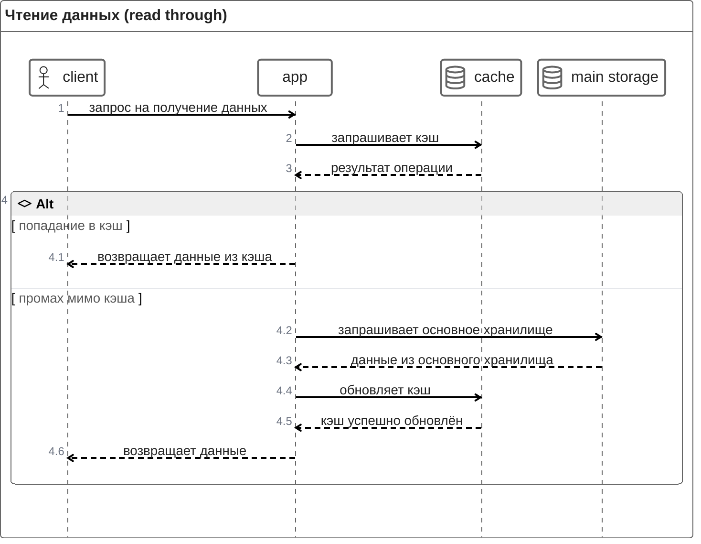
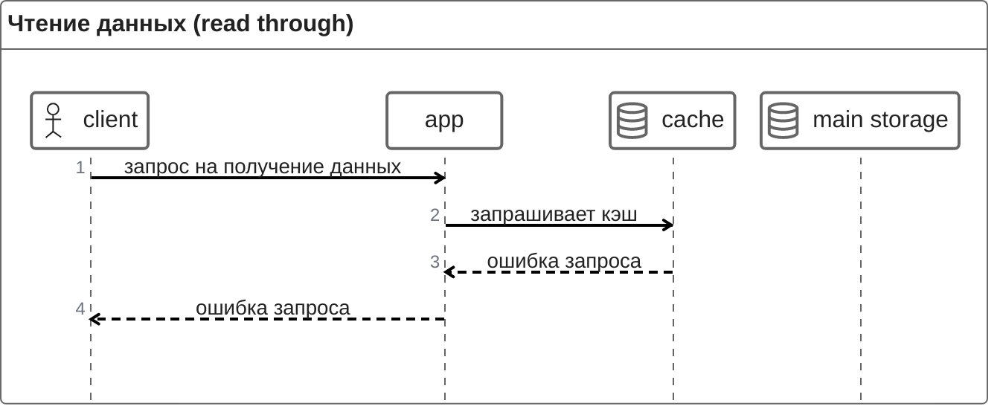
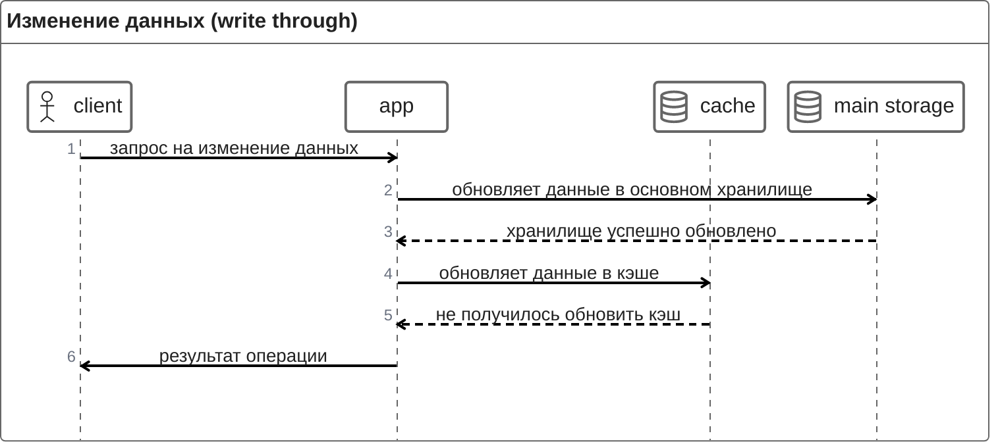
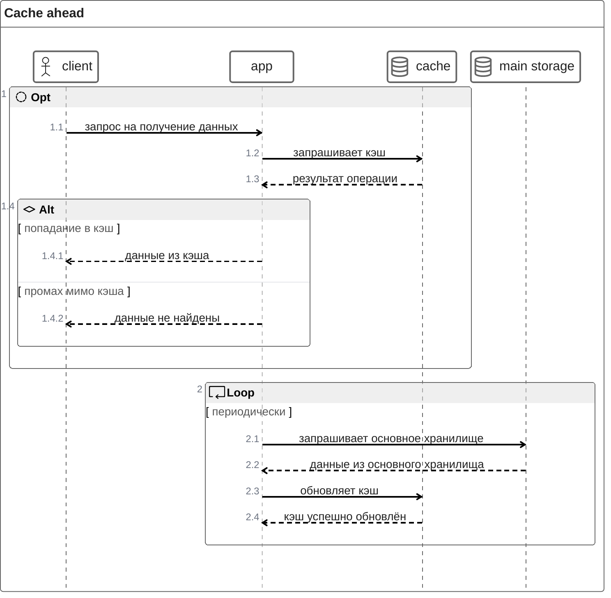
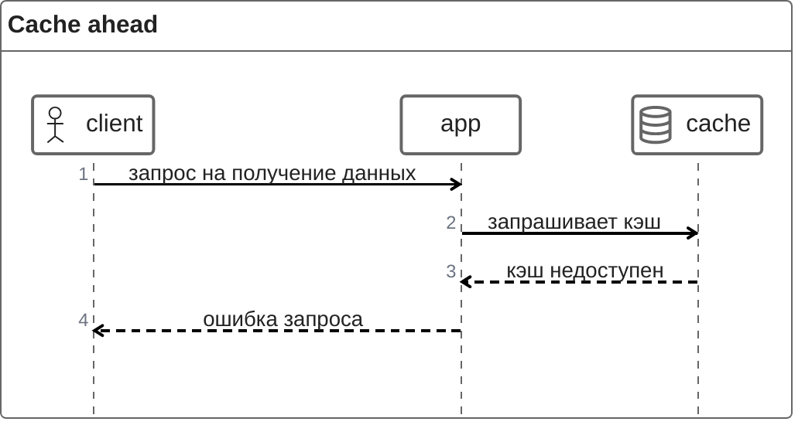

- [Стратегии доступа к данным](#стратегии-доступа-к-данным)
  - [Cache through](#cache-through)
  - [Cache ahead](#cache-ahead)

# Стратегии доступа к данным

## Cache through

Такая стратегия предполагает, что запросы на чтение и на изменение данных чётко разделены.

Приложению нужен контроль за изменением данных, чтобы поддерживать кэш в актуальном состоянии.

Основное хранилище представляет собой первую точку отказа. Выделенный кэш — вторую (можно сделать разумное допущение, что in-app кэш работает всегда, когда работает приложение).

### Happy path

### Проблемы

Недоступность кэша при запросе на чтение данных:

Недоступность кэша при запросе на изменение данных:

## Cache ahead

Эта стратегия подходит только для запросов **на чтение**. Приложение запрашивает только кэш при обслуживании этих запросов. 

Также организуется отдельный периодический процесс, который обновляет данные в кэше, загружая туда данные из основного хранилища.

При использовании этой стратегии заранее предполагается, что запрашиваемые данные не будут актуальными.

### Happy path

### Проблемы

Недоступность кэша при запросе на чтение данных:

В случае, если при синхронизации кэша с основным хранилищем недоступен либо кэш, либо хранилище, приложение продолжит отдавать последние актуальные данные.
