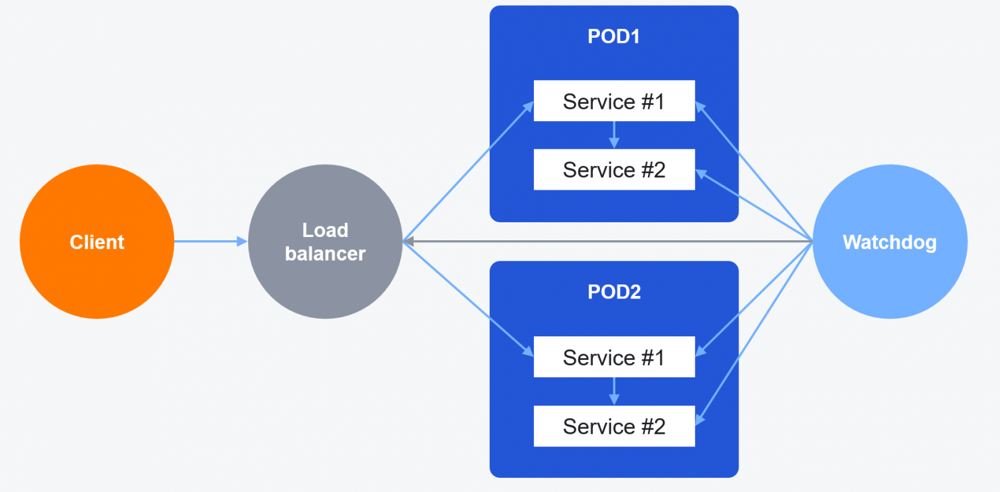

# Пробы

## Проблема

Обычно запускается несколько (не меньше 2) экземпляров приложения, и входящие запросы отправляются какому-то из них. В каждом экземпляре может произойти сбой, или приложение может исчерпать свои ресурсы. Отправлять входящие запросы на такие экземпляры нет смысла, потому что они скорее всего закончатся ошибкой.

Однако, экземпляр приложения может восстановиться после сбоя, или обработать свои задачи и освободить ресурсы. В таком случае, надо вернуть этот экземпляр в балансировку.

Эта проблема решается с помощью паттерна **health check**, или проб. В k8s выделяют liveness и readiness пробы; о разнице между ними и об их особенностях можно почитать в материалах.

Различные примеры реализации проб хорошо описаны в [документации k8s](https://kubernetes.io/docs/tasks/configure-pod-container/configure-liveness-readiness-startup-probes/). В docker-compose можно настраивать [healthcheck](https://docs.docker.com/reference/compose-file/services/#healthcheck). 

## Пример неправильно настроенных проб

Сервис `agent-gateway` загружает конфигурацию хостов через API и раздаёт её агентам на хостах по grpc. По логике, новый экземпляр (k8s pod) `agent-gateway` должен считаться готовым обрабатывать grpc-запросы только тогда, когда он загрузил конфигурации для всех хостов, или хотя бы для достаточной части от всех хостов, например, 75%.

Но в реальности для сервиса настроена только наивная tcp-проба: сервис считается готовым, если он просто начал слушать tcp-порт. Вот что происходит при перевыкатке сервиса:

