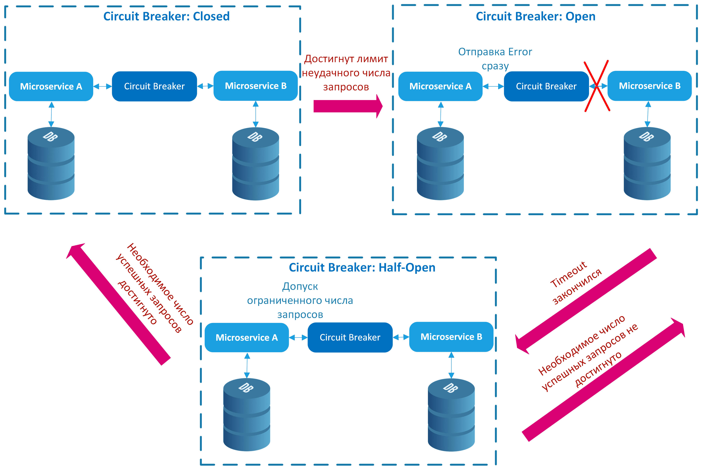

# Bulkhead и circuit breaker

Оба этих паттерна служат для того, чтобы ограничивать влияние на сервисов на другие сервисы и на общие ресурсы. 

Схемы взяты из [статьи vk cloud](https://cloud.vk.com/blog/26-osnovnyh-patternov-mikroservisnoj-razrabotki/).

## Bulkhead

Использование паттерна заключается в ограничении ресурсов, которые может использовать сервис или экземпляр приложения.

Пример на уровне кода приложения — настройка пула подключений к postgres/redis/etc.

Пример на уровне СУБД — настройка [superuser-reserved-connections](https://postgrespro.ru/docs/postgrespro/9.5/runtime-config-connection#guc-superuser-reserved-connections) в postgres, которая позволяет DBA подключиться к серверу, даже если все доступные подключения исчерпаны.

## Circuit breaker

Исходим из предположения, что если запросы к какой-то системе/сервису *часто за последнее время* завершались с ошибкой, то стоит на какое-то время вообще перестать совершать запросы к этой системе:

В коде на golang можно использовать пакет [github.com/sony/gobreaker/v2](https://github.com/sony/gobreaker). В этом пакете реализован как локальный (внутри приложения), так и распределённый (с помощью redis) circuit breaker.
