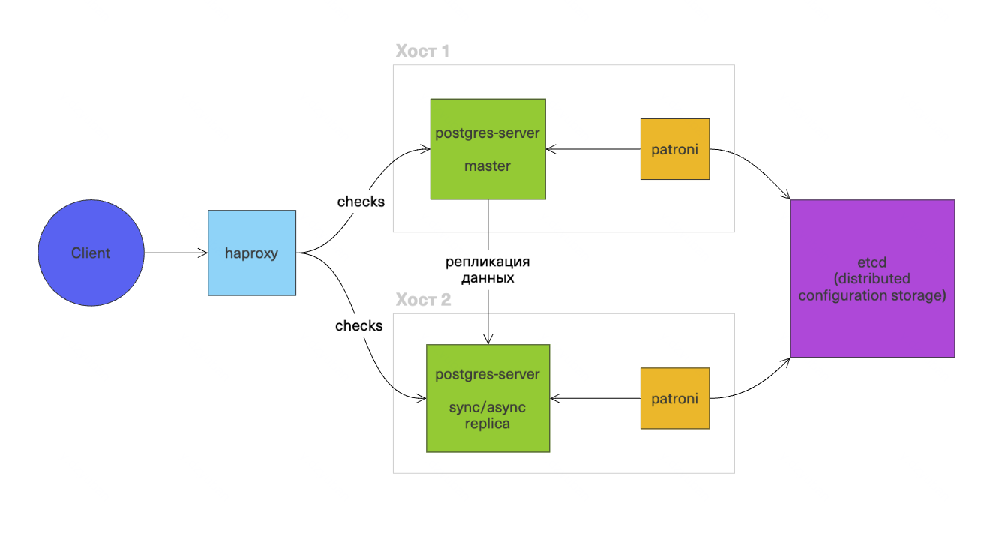
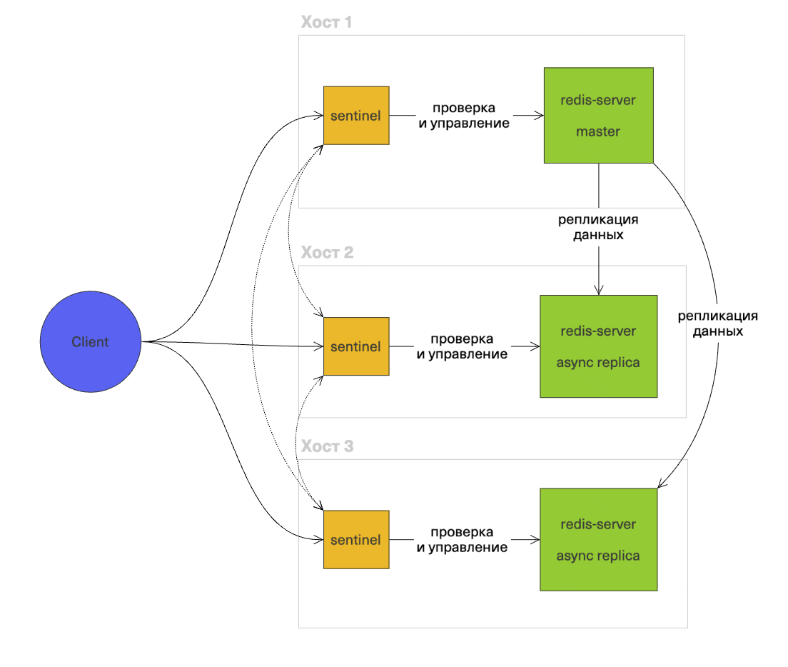
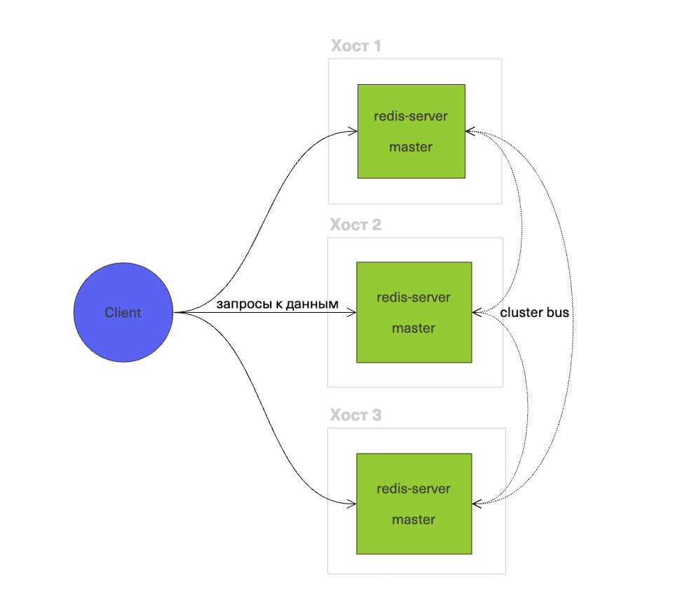

# Failover

Аварийное переключение — паттерн, который применяется в кластерах СУБД, чтобы обеспечить их высокую доступность.

В общем случае, чтобы failover корректно работал, нужно:

- чтобы было, куда переключаться с отказавшего узла; то есть, должна быть репликация данных между узлами
- кто-то, кто произведёт переключение
- чтобы клиенты тоже поняли, что произошло переключение

## postgres + patroni

В patroni реализуется паттерн bot, или agent:

Клиент может подключаться через haproxy. В этом случае, haproxy берёт на себя отвественность понять, что произошло переключение, и перенаправить запрос к актуальному мастеру.

Эту функцию может взять на себя и клиентский драйвер postgres, если он поддерживает опцию [target_session_attrs](https://www.postgresql.org/docs/current/libpq-connect.html#LIBPQ-CONNECT-TARGET-SESSION-ATTRS). 

## redis + sentinel

Дополнительно к нодам redis, поднимаются sentinel-ноды (на схеме они размещены на тех же хостах, что и redis, но это не обязательно так). Sentinel-ноды проверяют доступность и роли (master/replica) соответствующих нод redis, а также при необходимости повышают или понижают роль ноды.

Клиент обращается к sentinel-нодам (по очереди), и каждая из этих нод возвращает адрес актуального мастера.

## redis cluster

Ноды кластера попарно обмениваются друг с дружкой информацией о своём состоянии через протокол cluster bus. Информация о состоянии кластера в конечном счёте распространяется на каждую ноду в кластере.

Если откажет один из мастеров, то остальные ноды узнают об этом и выберут нового мастера (если это возможно).

Все клиенты также узнают об изменениях в состоянии кластера в конечном счёте.

