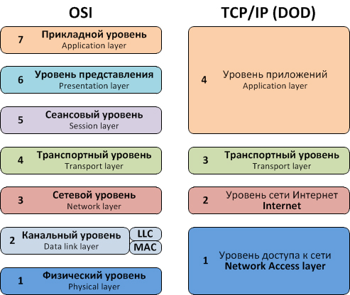

### HTTP-протокол, HTTP-сервер и обработка (жизненный цикл) запроса

**Сетевой протокол** — это набор правил и стандартов, которые определяют, как данные передаются и обрабатываются в компьютерных сетях. Протоколы определяют форматы сообщений, синтаксис команд и правила взаимодействия между устройствами, а также обеспечивают надежность и безопасность передачи данных.

### HTTP
Лучше, чем у Mozila, написано только в Таненбауме.

https://developer.mozilla.org/ru/docs/Web/HTTP

### Как работают сервера Python
**WSGI (Web Server Gateway Interface)** — это спецификация для взаимодействия между веб-серверами и веб-приложениями на языке Python. Основная цель WSGI — обеспечить стандартный интерфейс для передачи запросов от веб-сервера к приложению и ответов от приложения обратно к веб-серверу, что позволяет создавать переносимые и гибкие веб-приложения.

https://peps.python.org/pep-3333/

**Преимущества WSGI**

* **Совместимость**: спецификация позволяет веб-приложениям и серверам работать вместе независимо от их конкретной реализации.
* **Масштабируемость**: WSGI позволяет легко подключать к приложению различные серверы, что повышает гибкость и масштабируемость.
* **Независимость от реализации сервера**: разработчики могут выбирать сервер, который будет использоваться для развертывания приложения, что дает свободу в выборе оптимальных инструментов для решения конкретных задач.

### Аутентификация и авторизация
Аутентификация - кто ты?, Авторизация - что тебе можно?

#### Механизмы аутентификации:
https://developer.mozilla.org/en-US/docs/Web/HTTP/Authentication
* Basic Auth: "Базовая" схема HTTP-аутентификации определена в RFC 7617, передаёт учётные данные в виде пар пользователь ID/пароль (user ID/password), закодированных с использованием base64.
* Bearer Token: Тип авторизации с использованием токена, который предоставляется пользователю после успешной аутентификации для доступа к защищенным ресурсам.
* OAuth 2.0: https://oauth.net/2/
* JWT(Json Web Token): это JSON объект, который определен в открытом стандарте RFC 7519. Он считается одним из безопасных способов передачи информации между двумя участниками. Для его создания необходимо определить заголовок (header) с общей информацией по токену, полезные данные (payload), такие как id пользователя, его роль и т.д. и подписи (signature).

### Json как основной стандарт передачи данных
* Base64-кодирование https://datatracker.ietf.org/doc/html/rfc4648
* multipart/form-data https://datatracker.ietf.org/doc/html/rfc7578

